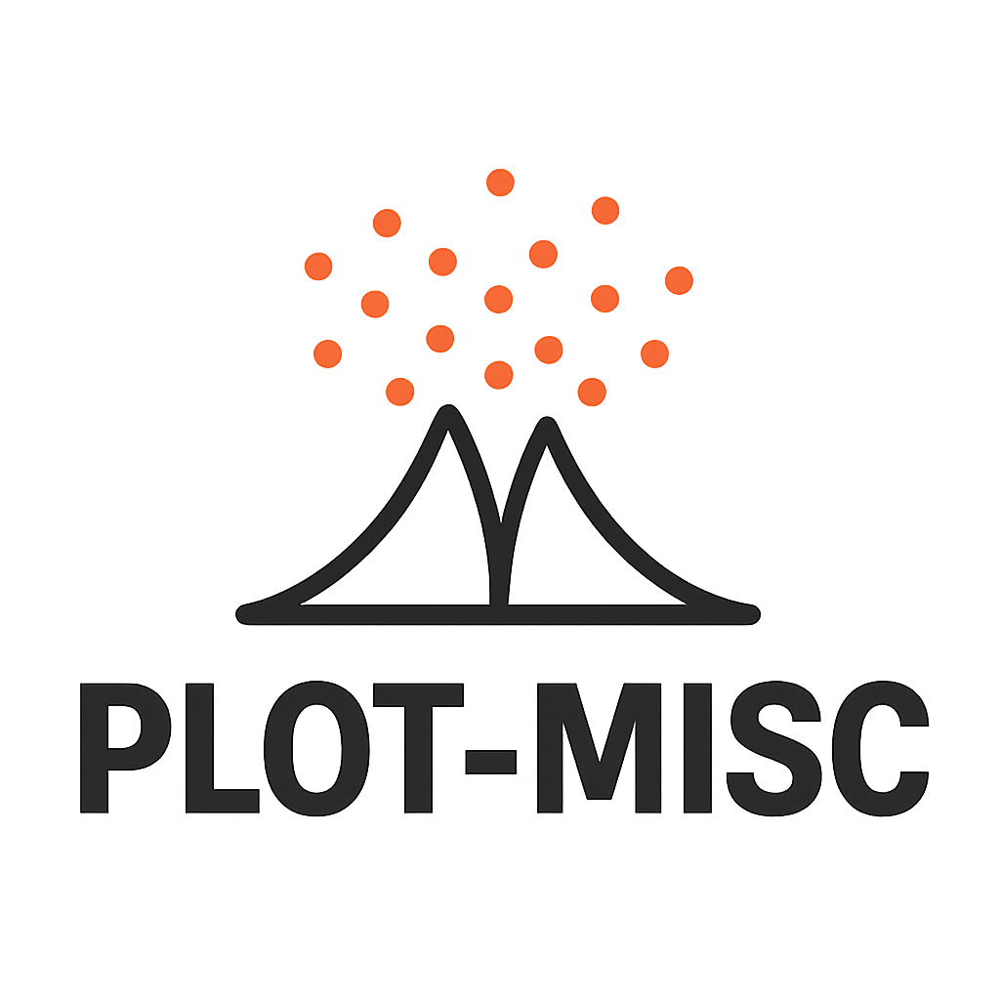

.. plot-misc documentation master file, created by
   sphinx-quickstart on Tue Feb 13 20:43:34 2024.
   You can adapt this file completely to your liking, but it should at least
   contain the root `toctree` directive.

   
----------------------------

Plot-misc
=========

This is |release| (short: |version|).

Plot-misc is a Python package that extends matplotlib with a
curated collection of functions and classes designed for streamlined
data visualisation.
The package provides lightweight, user-oriented plotting capabilities
whilst maintaining full compatibility with matplotlib's native functionality.

Built with flexibility in mind, Plot-misc returns standard matplotlib figure
and axes objects, enabling users to apply additional customisations using
familiar matplotlib methods.
This approach ensures that the package serves as an enhancement rather than a
replacement for existing matplotlib workflows.

The package adopts a focused philosophy: it attempts to concentrates exclusively
on plotting functionality and expects users to provide appropriately formatted data.
This design creates a direct, predictable relationship between your prepared
datasets and the resulting visualisations, promoting clear and efficient plotting
workflows.

Installation
----------------------------

To install the package from PyPI, run:

.. code-block:: console

    pip install plot-misc

or instead using conda:

.. code-block:: console

    conda install afschmidt::plot_misc

Documentation
=============

.. toctree::
   :maxdepth: 1
   :caption: Quickstart & Examples
   
   examples/plots/barcharts.nblink
   examples/plots/forestplot.nblink
   examples/plots/heatmap.nblink
   examples/plots/incidencematrix.nblink
   examples/plots/machine_learning.nblink
   examples/plots/pychart.nblink
   examples/plots/volcanoplot.nblink

.. toctree::
   :maxdepth: 1
   :caption: Additional documenation
   
   api

.. toctree::
   :maxdepth: 1
   :caption: Project admin

   contributing
   design_philosophy
   raising_issues

Indices and tables
==================

* :ref:`genindex`
* :ref:`modindex`
* :ref:`search`
